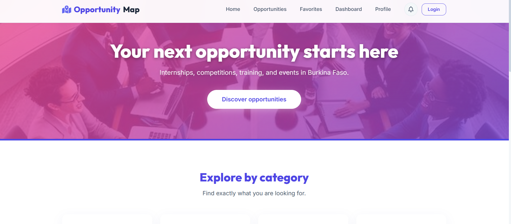
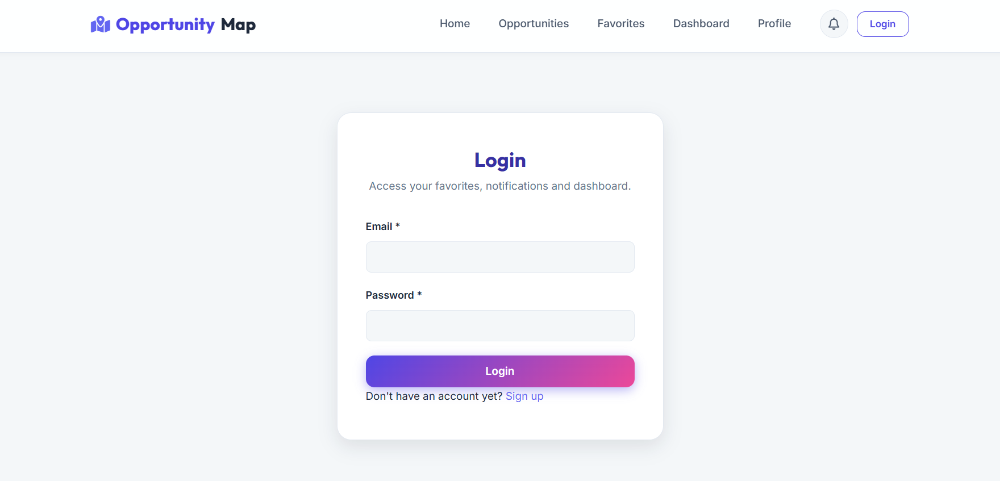
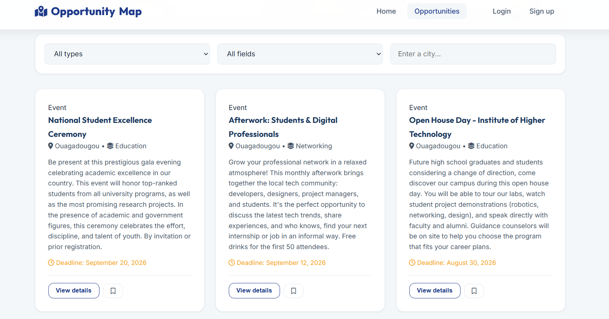
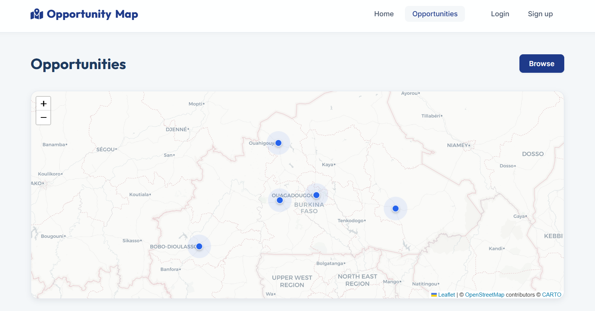
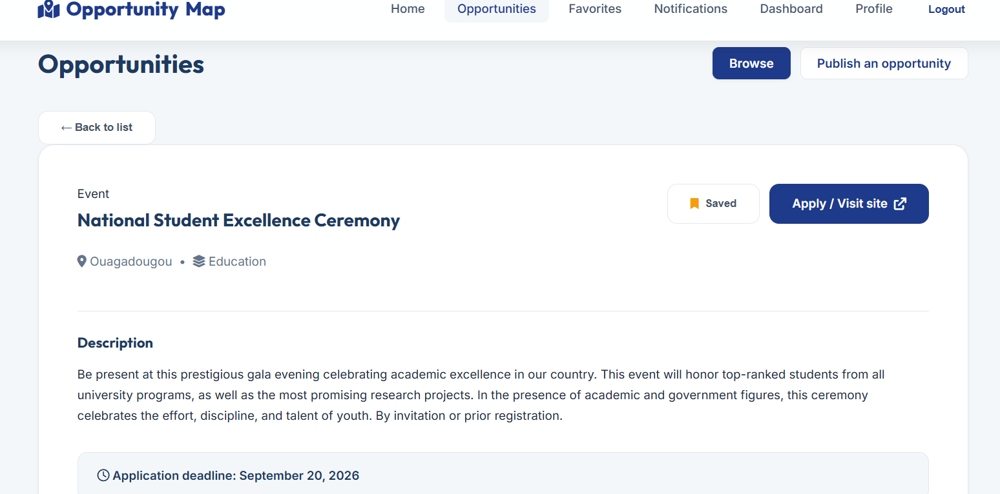
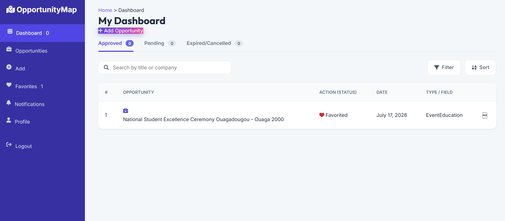

# 🗺️ OpportuniMap

**Centralizing professional and educational opportunities in Burkina Faso for equitable access to information.**



## The Project

In Burkina Faso, access to opportunities (internships, competitions, training programs, events) is deeply unequal. Information often circulates through word-of-mouth, physical bulletin boards, or closed groups, and is heavily concentrated in major cities. This disadvantages many students and young graduates—not because of a lack of merit, but simply due to a lack of access to information.

**OpportuniMap** solves this problem by providing a centralized, public, and geolocation-based web platform. The project relies on a comprehensive and modern architecture to ensure a seamless experience:

- **Backend**: A robust API built with Node.js and Express to handle the application's core logic.
- **Database**: PostgreSQL securely stores user profiles, opportunity listings, and favorites.
- **Frontend**: An interactive user interface (HTML/CSS/JS) integrating a Leaflet map to visualize the geographical distribution of opportunities.

## Key Features

- **Smart Filtering**: Easily search for opportunities by type (internship, competition, etc.), field, and city.
- **Interactive Map**: Visualize the geographical distribution of opportunities across the country at a glance.
- **Personalized Favorites**: Save interesting opportunities to your personal dashboard to apply later.
- **Community Publishing**: Any registered user can publish and share new opportunities with the community.
- **Secure Authentication**: User accounts are protected with JSON Web Tokens (JWT) and hashed passwords.







## Quick Start

The project was designed to be easy to launch: the backend server automatically serves the user interface.

### 1. Prerequisites
- [Node.js](https://nodejs.org/) installed on your machine.
- [PostgreSQL](https://www.postgresql.org/) installed and configured.

### 2. Database Configuration
1. Create a local database (e.g., `opportunimap_db`).
2. Run the provided SQL script in `backend/database/create_database.sql` to generate the table structures.

### 3. Installation and Launch
Open your terminal and run the following commands:

```bash
# Enter the main server directory
cd backend

# Install all required dependencies
npm install

# (Optional) Populate the database with mock opportunities to test the site
node seeds/seed-run.js

# Launch the application
npm run dev
```

Then, open your browser and navigate to **`http://localhost:5000`** to see the site in action.

---
*Project designed and developed by Farida Garane.*